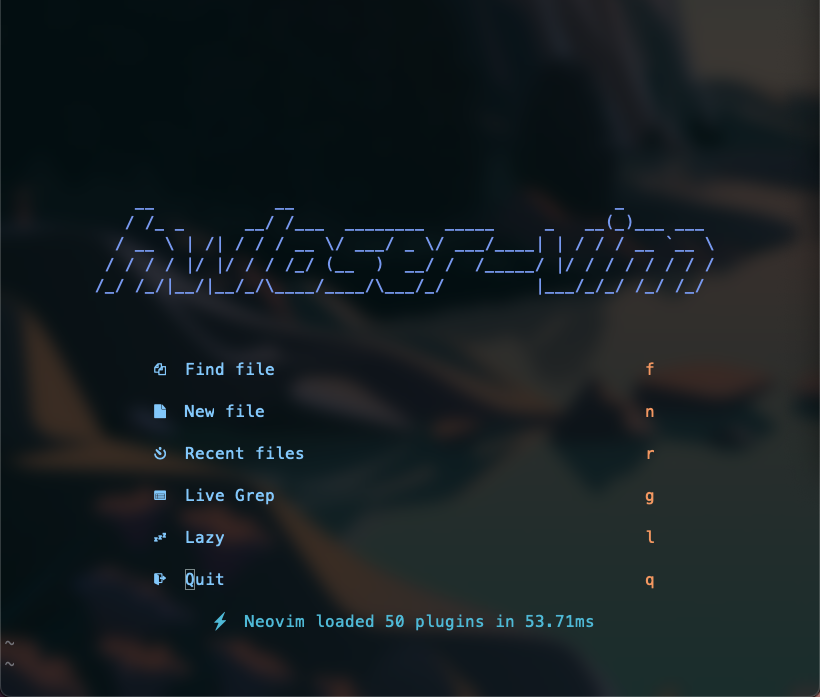

# hwloser-vim

* [preview](#preview)
* [More Infomation](#more-infomation)
* [Some details of configuration](#some-details-of-configuration)

---

## preview

## More Infomation

If you want try learn how this project build? Try the under steps:

- [Project description](./description.md)
- [How to install](./howtoinstall.md)
- [How to use](./howtoconfigure.md)
- [Some details of configuration]()

---

## Some details of configuration

> to be continue
