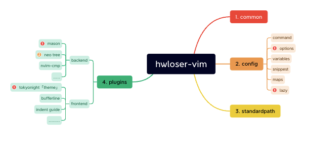

# Abstract description

This is only for teach you how to install our configuration.

Lets talk about some terminology:

- neovim
    - neovim is significant promotion of vim. Check it feature under the website.
    - please check for more infomation: [official website](https://neovim.io/)
- standard path
    - `:echo &rtp`, this command will tell you, where place will be load in vim.
    - `:echo &packpath`, this command will tell you where plugins will be load in place.
    - So we know that the place vim load is fixed, it will conflict with the other config manager. We have to change it for a new config manager without conflict.
- ......to be continue

---

# Architecture

