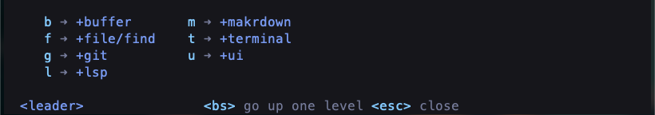
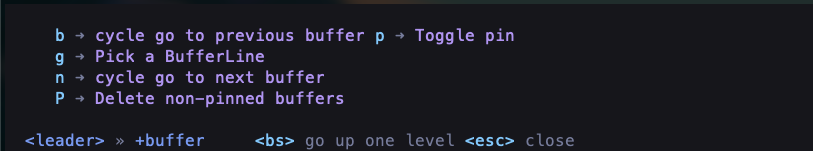
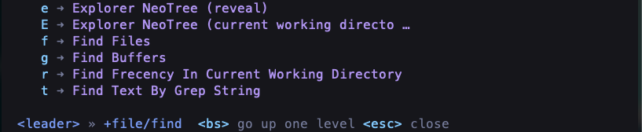
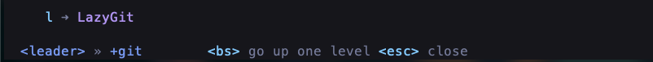
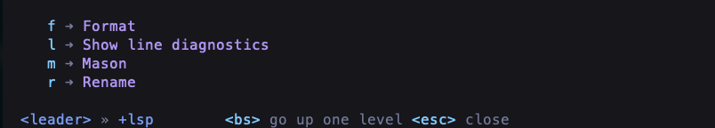
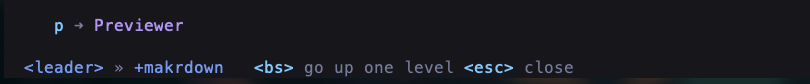
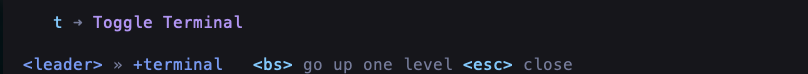
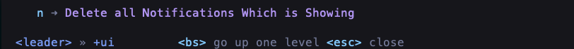

# Leader Key Description

## 1. leader key main page

- **buffer**: Manipulate buffer prefix 
- **file/find**: File search and other operations
- **git**: Some operations of git
- **lsp**: Manipulate lsp「language server protocol」prefix
- **makrdown**: ...
- **terminal**: ...
- **ui**: To process terminal UI

## 2. buffer

!> command: `<leader>b`

- **b**: If you open more bufferline, like `figure 1`, you can use `<leader>bb` to go previous buffer tab.
- **n**: Reverse operation compare above.
- **g**: Pick a buffer tab.

## 3. file/find

!> command: `<leader>f`

- **e**: Open an Neo-tree「reaveal」.

## 4. git

!> command: `<leader>f`

- **l**: Embedded lazygit windows.

## 5. lsp

!> command: `<leader>l`

- **f**: Reformat code format「please install lsp-server firstly」.
- **m**: Open Mason for lsp manager.

## 6. makrdown

!> command: `<leader>m`

## 7. terminal

!> command: `<leader>t`

## 8. ui

!> command: `<leader>u`

