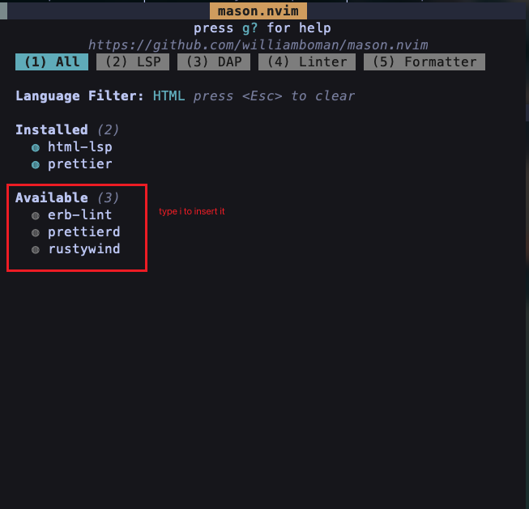

# Language Server Protocol

!> You can use `:Mason` to choose your favorite LSP.

## Example

Above figure which show what i installed, so type `i` to install what you want.

## Mason

`:h mason-nvim`, this command will tell you everything.
